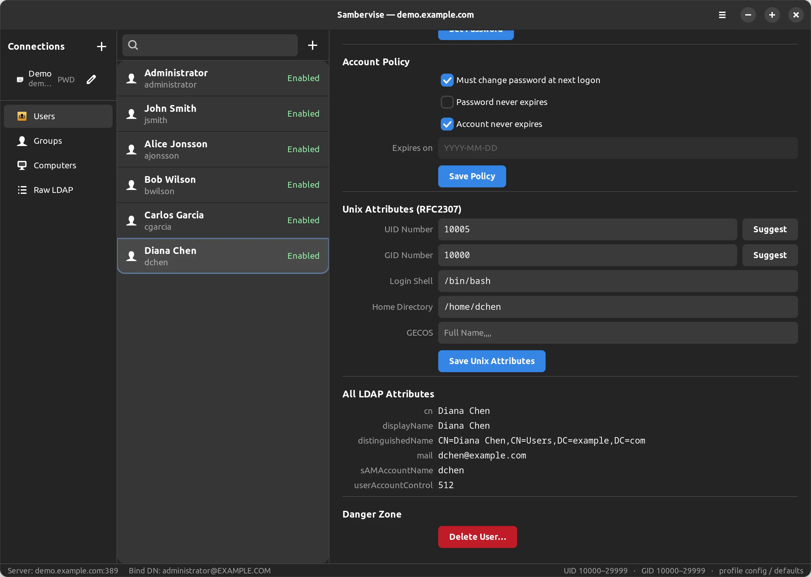

# Sambervise

A Linux GUI application for remotely administering Samba 4 Active Directory Domain Controllers.

Sambervise connects to remote DCs over LDAP/LDAPS. It has no effect on the local machine and requires no local elevated privileges.

## Features

- **User management** — browse users, edit names and contact details, enable/disable accounts, reset passwords, and configure password policy (force change at next logon, never expires, account expiry)
- **Group management** — browse groups, view membership, add and remove members
- **Computer management** — browse computer accounts, view OS info and Service Principal Names, edit description and DNS hostname, enable/disable accounts
- **Multiple connection profiles** — save and switch between named connections; profiles are stored in `~/.config/sambervise/connections.ini`
- **Authentication** — Kerberos/GSSAPI (uses existing `kinit` credentials) or simple bind with password
- **DC discovery** — finds Domain Controllers automatically via DNS SRV records (`_ldap._tcp.dc._msdcs.<domain>`)
- **TLS support** — LDAPS and STARTTLS

## Requirements

### Build dependencies

```
cmake >= 3.18
pkg-config
libgtk-4-dev
libadwaita-1-dev       (>= 1.2)
libldap-dev
```

On Debian/Ubuntu:

```bash
sudo apt install build-essential cmake ninja-build pkg-config \
    libgtk-4-dev libadwaita-1-dev libldap-dev
```

### Runtime dependencies

- `libsasl2-modules-gssapi-mit` — required for Kerberos authentication (usually already installed)
- A reachable Samba 4 AD DC

```bash
sudo apt install libsasl2-modules-gssapi-mit
```

## Building

```bash
cmake -B build -G Ninja
cmake --build build
```

To run from the source tree without installing:

```bash
GSETTINGS_SCHEMA_DIR=build/data ./build/src/sambervise
```

## Installing

```bash
sudo cmake --install build
```

This installs the binary, desktop entry, and GSettings schema, and recompiles the system schema cache automatically.

To install to a custom prefix (e.g. `/usr/local`):

```bash
cmake -B build -G Ninja -DCMAKE_INSTALL_PREFIX=/usr/local
cmake --build build
sudo cmake --install build
```

## Building a Debian package

After configuring and building, run CPack from the build directory:

```bash
cmake -B build -G Ninja
cmake --build build
cd build && cpack -G DEB
```

This produces `sambervise_0.1.0_amd64.deb` (name and architecture are determined automatically). Install it with:

```bash
sudo dpkg -i sambervise_0.1.0_amd64.deb
```

The package depends on `libgtk-4-1`, `libadwaita-1-0`, `libldap-2.5-0`, and `libsasl2-modules-gssapi-mit`. The GSettings schema cache is updated automatically via the package's postinst script.

## Screenshots



- [Users (detailed view)](docs/users2.webp)
- [Groups panel](docs/groups1.webp)
- [Computers panel](docs/computers1.webp)

## Kerberos authentication

For connections using Kerberos, obtain a ticket before launching Sambervise:

```bash
kinit administrator@EXAMPLE.COM
```

Sambervise will use the credential cache automatically. No password prompt is shown for Kerberos profiles.

## Running tests

```bash
ctest --test-dir build --output-on-failure
```

## License
GPLv3
